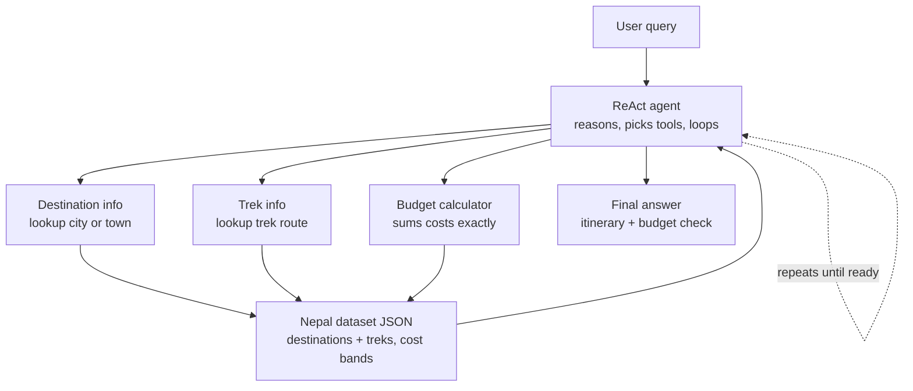
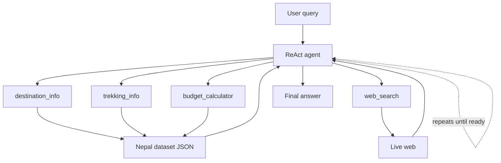

# Nepal Trip Planner — AI Agent

A ReAct-style AI agent that helps plan trips to Nepal — destinations, treks, and budgets — built with **LangGraph**, backed by a curated dataset, with live web search as a fallback, and wrapped in a **Django** chat application with user accounts and persistent conversation history.

This project was built as a hands-on learning exercise in agentic AI systems: going from a hand-drawn architecture diagram, to a working multi-tool LangGraph agent, to a full-stack Django chat app — debugging real failures along the way rather than treating the first working version as the final one.

---

## Architecture

The original design, before any code was written:



A fourth tool — **web search** — was added early on to cover anything the static dataset couldn't: current weather, trail closures, visa rules, festival dates. The final tool set:



The graph itself — nodes, edges, and the conditional loop — was built **manually with LangGraph's `StateGraph`**, rather than using the higher-level `create_react_agent` shortcut. The loop logic is a handful of lines and never changed once it was proven correct:

```python
def should_continue(state: MessagesState):
    last_message = state["messages"][-1]
    if last_message.tool_calls:
        return "tools"
    return END

graph = StateGraph(MessagesState)
graph.add_node("agent", agent_node)
graph.add_node("tools", tool_node)
graph.set_entry_point("agent")
graph.add_conditional_edges("agent", should_continue, {"tools": "tools", END: END})
graph.add_edge("tools", "agent")
```

Building this by hand rather than using a prebuilt agent was a deliberate choice: it meant every failure later in the project could be traced to either _the tools_, _the prompt_, or _the model_ — never to an opaque framework internals issue, since the orchestration logic was fully visible and understood from day one.

---

## Tech stack

- **Agent orchestration:** LangGraph (`StateGraph`, `MessagesState`, conditional edges)
- **LLM:** Google Gemini (`gemini-2.5-flash` via `langchain-google-genai`) — initially prototyped against a local `llama3.1:8b` via Ollama
- **Tools:** 3 dataset-backed tools (structured JSON lookups) + 1 live web search tool (DuckDuckGo, free tier)
- **Persistence:** LangGraph's SQLite checkpointer for per-conversation agent memory
- **Backend:** Django — user accounts, conversation history, chat UI
- **Frontend:** Server-rendered Django templates, dark ChatGPT/Claude-style chat layout

---

## The build, in order

### 1. Proving the loop before building real tools

Before writing a single real tool, the first thing built was a **dummy tool skeleton** — `fake_tool` returning a hardcoded string — wired into a minimal `agent → tool → agent → END` graph. The goal was to isolate _plumbing_ (does the loop work at all?) from _logic_ (does this specific tool work?), so that any later bug could be diagnosed without wondering whether the graph itself was broken.

```
[0] HumanMessage  -> "Tell me something about Pokhara"
[1] AIMessage     -> tool_calls: [fake_tool(city='Pokhara')]
[2] ToolMessage   -> "FAKE DATA: Pokhara is a lovely place..."
[3] AIMessage     -> "Pokhara has three notable attractions: Phewa Lake, Sarangkot, Davis Falls..."
```

This run also surfaced an important early lesson: the model **filled in real, specific facts** (Phewa Lake, Sarangkot) that the fake tool never provided. Given a thin or fake tool result, the model blends its own pretrained knowledge in — a preview of the grounding problem the rest of the project had to design around.

### 2. Dataset-backed tools: `destination_info` and `trekking_info`

Both tools do **exact-match dictionary lookups** against a curated JSON dataset — deliberately _not_ a RAG/vector-search pipeline, since the data is small, structured, and needs exact retrieval (a `cost_min_npr` field needs to come back precisely, not "semantically similar").

A real bug was found and fixed early: `destination_info`'s first version had a `for...if...else` loop where the `else` fired on _every non-matching item_, returning "not found" on the very first mismatch instead of checking the whole list:

```python
# BUGGY -- returns "not found" on the first non-match, never checks further
for dest in destinations:
    if dest["name"].lower() == city.lower():
        return dest
    else:
        return {"found": False, ...}   # fires immediately, loop never continues

# FIXED -- "not found" only runs after the loop exhausts every item
for dest in destinations:
    if dest["name"].lower() == city.lower():
        return {"found": True, "data": dest}
return {"found": False, "available_destinations": [...]}
```

`trekking_info` added a second layer: a **3-pass fuzzy matcher** (exact match → substring match → `difflib` similarity match), since the LLM would often guess trek names slightly off from the dataset's exact strings (`"Annapurna Circuit"` vs. the dataset's `"Annapurna Circuit Trek"`). This matching logic was factored into a shared `fuzzy_find()` helper, reused by both `trekking_info` and `budget_calculator`, rather than duplicated.

### 3. `budget_calculator` — the arithmetic tool

Deliberately built so the LLM **never does the math itself** — small models are unreliable at multi-step arithmetic, and the dataset's cost fields have mixed units (per-night, per-day, one-time, trip-total) that are easy to mix up even for a careful human. The tool takes a destination, day count, tier, optional activities, and optional trek, and returns a full breakdown plus a grand total — all computed deterministically in Python.

### 4. `web_search` — the live-data fallback

Wraps `DuckDuckGoSearchRun` (free, no API key) for anything outside the dataset's scope: weather, trail closures, visa rules. Wrapped in a `try/except` so a failed search returns a clean `{"found": False}` instead of crashing the whole agent run.

### 5. The system prompt — steering judgment, not just tool selection

The system prompt grew to **11 explicit, numbered rules**, each added in response to a _specific, observed failure_ rather than speculative caution:

| #   | Rule (summarized)                                                     | Added because of                                                                                                                                                                                                                                                                                                                      |
| --- | --------------------------------------------------------------------- | ------------------------------------------------------------------------------------------------------------------------------------------------------------------------------------------------------------------------------------------------------------------------------------------------------------------------------------- |
| 1   | Prefer dataset tools over general knowledge                           | Baseline grounding                                                                                                                                                                                                                                                                                                                    |
| 2   | Use `accessible_treks` as source of truth for "near X" questions      | Model called `trekking_info` on Everest Base Camp when asked about treks near Pokhara — EBC isn't even close to Pokhara, but it's the most famous Nepal trek, so the model guessed it from memory                                                                                                                                     |
| 3   | Don't guess on `found: false`                                         | Baseline grounding                                                                                                                                                                                                                                                                                                                    |
| 4   | Always use `budget_calculator`, never hand-sum costs                  | Baseline grounding                                                                                                                                                                                                                                                                                                                    |
| 5   | Say so explicitly when the dataset can't help                         | Baseline grounding                                                                                                                                                                                                                                                                                                                    |
| 6   | Don't infer unstated geographic relationships                         | After rule 2's fix, the model _stopped calling the wrong tool_ but still **reasoned its way** to a false claim — stating Annapurna Circuit "passes through the region where Everest Base Camp is located" (false), without ever calling a tool. Blocking the wrong tool call wasn't enough; the false _reasoning_ needed its own rule |
| 7   | Disclose `unmatched_activities` to the user                           | Silent gaps in budget calculations                                                                                                                                                                                                                                                                                                    |
| 8   | Synthesize partial/vague search results instead of refusing           | Web search returned messy, real snippets containing partial answers, but the model said "I have no information" instead of extracting what was actually there                                                                                                                                                                         |
| 9   | Restate days/tier/destination/trek before calling `budget_calculator` | A compound 5-part question caused the model to silently corrupt `days: 5` into `days: 10`                                                                                                                                                                                                                                             |
| 10  | Don't skip a sub-question with a generic disclaimer                   | In the same compound-question test, the model skipped calling `web_search` entirely for the weather part of the question                                                                                                                                                                                                              |
| 11  | Answer generic, non-dataset questions directly and confidently        | Avoid over-applying dataset caution to questions that have nothing to do with the dataset (e.g. "what language is spoken in Nepal")                                                                                                                                                                                                   |

### 6. The model comparison: 8B local vs. a frontier hosted model

The single most valuable finding in this project came from a **deliberate side-by-side test**, not from chasing prompt tweaks indefinitely. The same compound question — _"5-day mid-range trip to Pokhara with the Annapurna Base Camp trek, paragliding, and any recent weather concerns, what's the total cost?"_ — was run against the same tools and the same system prompt, on two different models:

**`llama3.1:8b` (local, via Ollama):**

- Corrupted `days: 5` into `days: 10` (a compound-question, multi-fact extraction failure)
- Skipped the web search sub-question entirely, or in a later attempt, _narrated_ an intention to search ("I would like to call the web_search tool...") without actually emitting the tool call

**`gemini-2.5-flash` (hosted):**

- Correctly extracted all arguments (`days: 5`, right tier, right trek)
- Correctly fired all 4 relevant tool calls across **two full loop iterations** — 3 tools in parallel on the first pass, recognized it wasn't done yet, called the 4th tool on a second pass, then produced a final answer
- Correctly synthesized messy, multilingual web search snippets into specific, dated facts (a hotel damage report, a specific multi-day closure window)

This is strong evidence that the **architecture and prompt design were already correct** — the `should_continue` loop, unmodified since the very first dummy-tool test, is exactly what allowed the better model to correctly recognize "I'm not done yet" and loop a second time. The bottleneck for compound multi-tool requests was model capacity, not graph design or prompt engineering.

### 7. Persistent memory — the LangGraph checkpointer

Initially, every `app.invoke()` call was a fresh, memoryless run — a follow-up question like _"what treks are accessible from there?"_ had no idea what "there" meant. Adding `SqliteSaver` and a `thread_id` per conversation fixed this with almost no code change:

```python
result1 = app.invoke({"messages": [...]}, config={"configurable": {"thread_id": "session-1"}})
result2 = app.invoke({"messages": [HumanMessage("What treks are accessible from there?")]},
                      config={"configurable": {"thread_id": "session-1"}})
# result2 correctly resolves "there" as Pokhara, with zero explicit context in the second message
```

### 8. Wrapping it in Django

The agent became a single importable function, `run_agent(thread_id, user_message) -> str`, so Django's view layer never needs to know anything about LangGraph internals:

- **Models:** `Conversation` (belongs to a `User`, holds a unique `thread_id`) and `ChatMessage` (belongs to a `Conversation`)
- **Auth:** Django's built-in `User` model and auth views, with custom-styled forms
- **Views:** standard Django pattern — GET shows a form, POST processes it, redirect-after-POST to avoid duplicate submissions
- **One `thread_id` per `Conversation`**, not per browser session — so a single logged-in user can hold multiple independent, isolated conversations, each with its own agent memory
- **A context processor** (`sidebar_conversations`) makes the user's conversation list available on every page automatically, powering a ChatGPT/Claude-style persistent sidebar
- **Markdown rendering**: agent responses are run through a custom template filter (`render_markdown`) so bold text and lists render as real HTML instead of literal `**`/`*` characters — user-typed messages are deliberately _not_ run through this, to avoid ever trusting raw user input as safe HTML

---

## Known limitations

Documented honestly rather than hidden:

- **Compound, multi-part requests are unreliable on small local models.** A single message asking about a destination, a trek, an activity, and live weather in one go pushed `llama3.1:8b` into argument corruption and dropped tool calls. The same request worked correctly on `gemini-2.5-flash`. This looks like a model-capacity ceiling rather than a fixable prompt issue.
- **Free web search (DuckDuckGo) returns noisy, unstructured snippets**, not clean extracted answers — occasionally including stale or ambiguous data (e.g. an old cached temperature reading). The system prompt asks the model to flag uncertainty rather than state these as confirmed facts, but this is a real ceiling of the free search tool compared to a paid, structured search API.
- **Conversation history is tied to a Django user account**, not synced across devices beyond that — there's no cross-device sync beyond a normal login.
- **SQLite is used for both Django's database and the LangGraph checkpointer.** This is fine for local development, but several free hosting tiers use ephemeral filesystems, meaning both databases could be wiped on a server restart unless deployed with a persistent disk or migrated to Postgres.

---

## What this project demonstrates

- Building a ReAct agent's control flow manually with LangGraph, rather than relying on a black-box prebuilt agent
- Debugging across multiple failure layers: Python logic bugs, LLM argument-generation errors, and prompt-level reasoning failures — and correctly distinguishing which layer a given bug actually belongs to
- Designing tool fallback hierarchies (structured dataset → fuzzy matching → live web search) with explicit signals (`found: True/False`) the agent can act on
- Running a genuine comparative model evaluation to separate "prompt/architecture problem" from "model capacity problem," instead of endlessly patching prompts
- Wiring a LangGraph agent into a real, persistent, multi-user Django application with proper auth, data ownership checks, and conversation isolation
